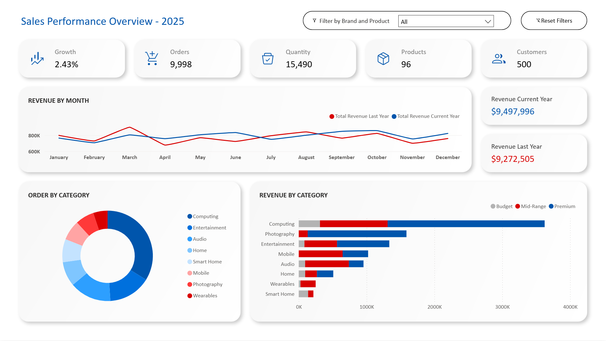
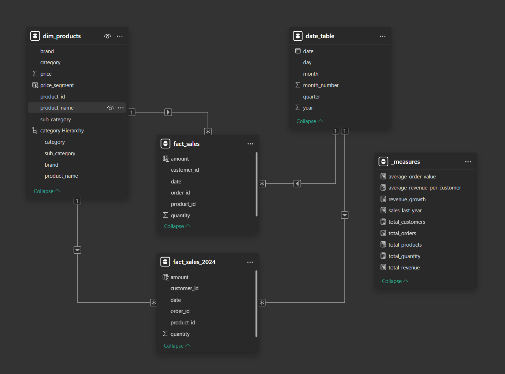
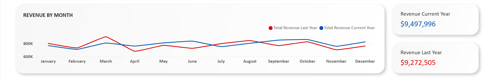
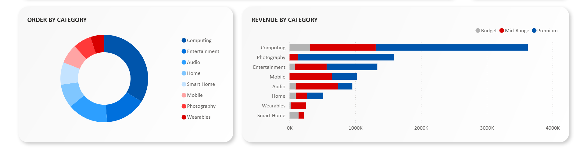
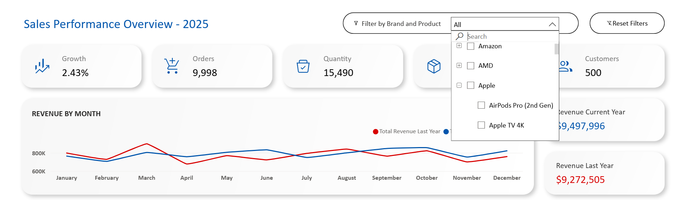

# Electronics Store Sales Performance Dashboard - Power BI (Basic)
Welcome to the **Electronics Store Power BI Sales Dashboard Project**💡

This basic Power BI dashboard creation project is done on the fictional data generated based on real world electronic store sales details for a fiscal year.

#### [Interactive Dashboard]() in Power BI Service

## 📌 Project Overview
Create a single page Power BI dashboard for an Electronics Store reporting all the essential metrics regarding their sales for the year 2025.  
The dashboard should be modern and minimalist following all the UI/UX principles for easy user experience

### Data Source
Two tables, two fact tables about sales from the past two years and one dimension table about the products
- Fact Tables [`fact_sales`](dataset/fact_sales.csv) and [`fact_sales_2024`](dataset/fact_sales_2024.csv)
- Dimension Table [`dim_products`](dataset/dim_products.csv)

### Data Model
The data model follows a Star Schema pattern with one to many relation from the products to sales tables

### Data Visuals
- KPI Cards for important metrics
- Charts for indicating Revenue over time
- Breakdowns of Orders and Revenue by Products

---

## 📊 Dashboard
The entire dashboard consist of a single page, divided into four section
- Main Title, Filter Dropdown and Reset Filters Button
- KPI Cards
- Line Chart and Two Measures
- Donut Chart and Bar Chart

The Dashboard is designed to evoke a clean and modern feel while keeping it user friendly

**Color Palette** - Primary , Secondary and Tertiary

**Typography** - `Calibri`

---

## 📋 Project Outline
The source data for this project is stored as two csv files, two fact tables for the sales details of the year 2025 and 2024 and one dimension table for product details. The `product_id` column links all the tables in a **Star Schema** pattern where the fact tables are at the centre and dimension tables are placed surrounding them. The project follows the standard four step process  
- **Power Query** for data cleaning and data standardization
- **DAX Calculations** for calculated columns and additional tables, mainly a dedicated `measures` and `date` table
- **Data Modelling** creates the relations between all the above tables, here the model follows a Star Schema pattern
- **Data Visualization** brings all the information from various tables into different charts and KPI cards for insights

### Power Query ⚙️
After connecting to the source data the first step is to clean the tables for any inconsistencies that may have occurred during the data creation process  
This include
- Checking the all the columns that contains a dimensional values for unwanted spaces and remove them using Trim function
- Checking for null values in the all the columns and replacing necessary columns with appropriate values
- Ensuring that the date column contains only date values and no null values and converting the date column into the 'Date' data type
- Ensuring that all the columns are marked with the correct data type, sales and price as 'Currency' for example

### DAX Calculations 📐
The DAX calculations for this dataset mainly consists of creating two dedicated columns, one for calculated metrics called 'measures and one for date
- **Measures Table**  
  The `measures` table contains all the necessary calculations derived from the existing data inside the tables. This include
  - `total_revenue` - Sum of all the sales
  - `total_orders` - Sum of all the distinct orders
  - `total_quantity` - Sum of all the order quantity
  - `total_products` - Count of all the products
  - `sales_last_year` - Sum of all the sales last year
  - `revenue_growth` - Increase in revenue compared to the previous year
  - `average_revenue_per_customer` - Total revenue divided by total customers
  - `average_order_value` - Total revenue divided by total orders
The formulas written as a single query in [`measures_dax_formulas`](scripts/measures_dax_formulas.txt)

- **Date Table**  
 The `date_table` is generated with all the dates from the sales fiscal year, it contains additional information regarding the **Quarter**, **Month** numerical and name and **Day** from the order date.
The [`date_dax_formula`](scripts/date_dax_formula.txt) contains the formula for creating date table

### Data Modelling 🔗
The Data Model for this dataset follow a **Star Schema** pattern. After the DAX calculation there are a total of five tables in the model.
- Fact tables - `fact_sales` and `fact_sales_2024`
- Dimension tables - `dim_products` and `date_table`
- Measures table - `measures`

The `fact_sales` and `fact_sales_2024` can be linked with the `dim_products` and `date_table` using the `product_id` and `order_date` columns respectively in a one to many relation from the fact to dimension  
The `measures` table is a standalone table as it does not contain any common column with the any other table

### Data Visualization 📊
The Data Visualization follows a modern minimalist approach for creating all the KPIs and Charts. A clean interface following UI/UX design principles is followed to makes the dashboard interaction easy and smooth

- The **KPI Cards**  
  The Key Point Indicators for this data includes
  - **Growth** - Increase in revenue compared to the previous year
  - **Orders** - Number of orders placed in the fiscal year
  - **Quantity** - Total number of products sold in the fiscal year
  - **Products** - Number od distinct products sold in the fiscal year
  - **Customers** - Number of customers who placed an order in the fiscal year
  
  

- Revenue by Month **Line Chart**  
  The increase and decrease in revenue for the current and pervious year at the month level explains the rise and fall the revenue by each month and how seasonal factors like holidays may have affected the sales. The two cards contains the the total revenue for the current and previous year gives the user a quick comparison between the sales

  

- Orders by Category **Donut Chart** and Revenue by Category **Bar Chart**  
  The two charts that breakdown the the Orders and Revenue by the same parameter 'Category' gives the user a quick glimpse into how categories are distributed across both orders and revenue generated.   While the donut chart shows part of the the total orders placed on a single category, the bar chart breaks it down even more by dividing the total revenue of each category into price ranges for a quick analysis of what price range do customers prefer when buying products from a certain category
  
  

- **Filtering**  
  One additional feature include the filtering by **Brand and Products** option along with a **Reset Filters** button to clear all filters

  

Altogether the Cards and Charts allow the user to take a simplified view into all the relevant details about the sales for a particular year, helping them reach business decisions without going through the entire data for the year

---

## 🪛Conclusion
This project is a study on how to create a simple dashboard with all the relevant data that the business owners might need to get a larger picture into the sales performance for a particular year. 
This dashboard does not contain advanced reporting features like multiple pages, filter pane, advanced KPIs and complex calculations, the idea of this project is to make a user friendly modern dashboard with basic visuals and intermediate level understanding of the reporting software.

Thank You for visiting this project 🚀

